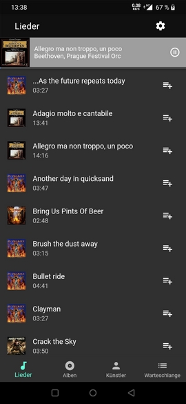
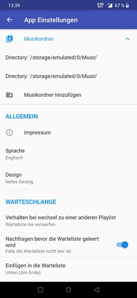
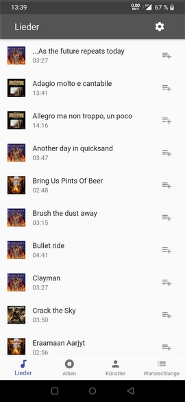

# flymusic

Flymusic is a simple Fulutter based music player, which is developed within a project at the University of Applied Sciences Fulda.

### Screenshots
    
    
    

### Funktions
- Play
- Stop
- Pause
- Show Album Art
- Fetch local songs
- queue
- Language (English, German)
- Theme (Light, Dark)
